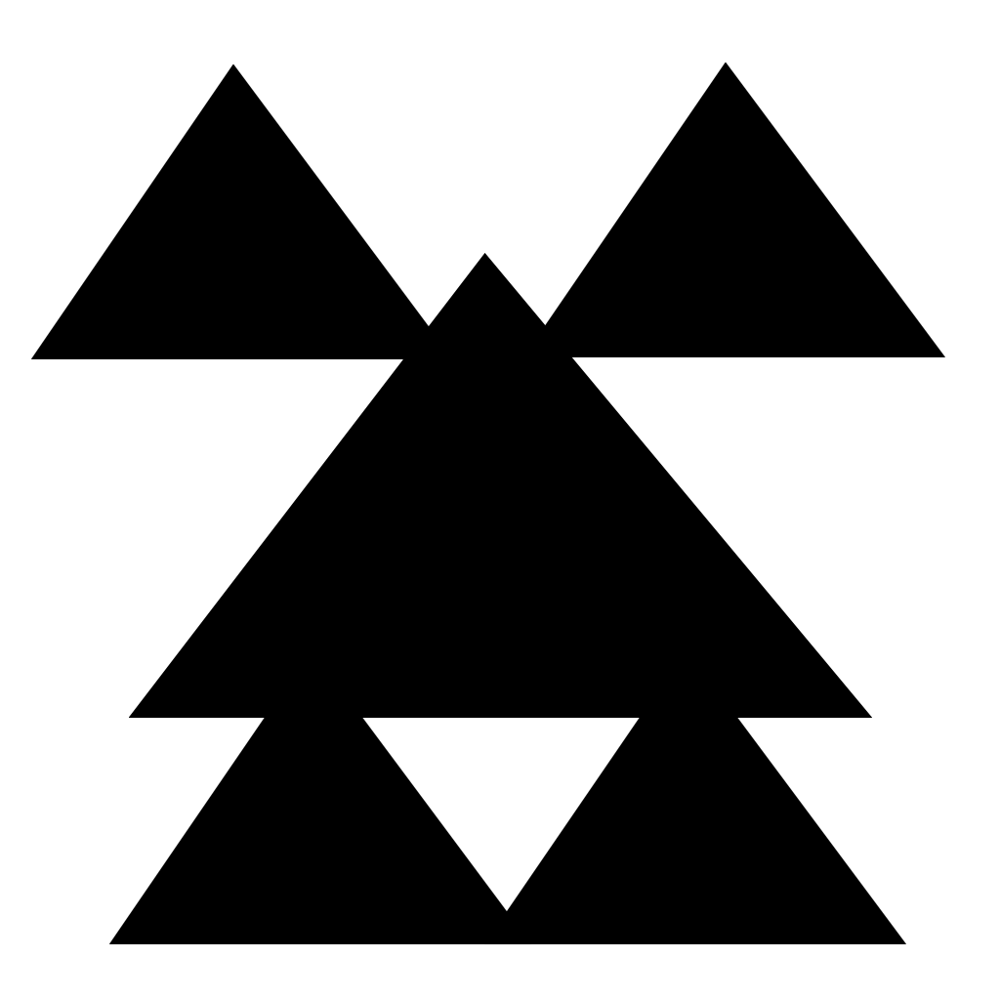
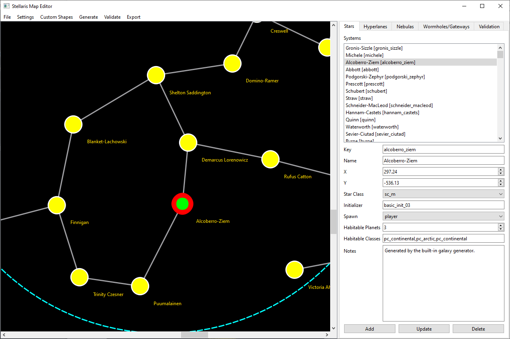
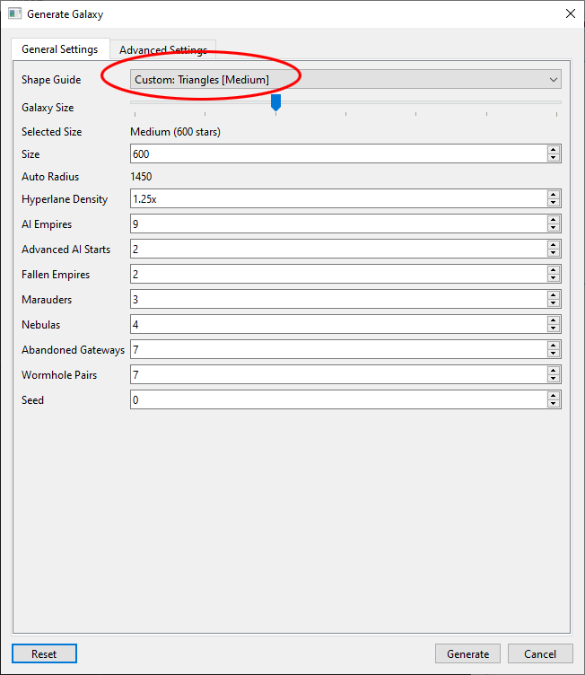

# Stellaris Map Editor
Stellaris Map Editor is a standalone custom galaxy creation and editing tool for Stellaris that allows players and modders to design, generate, edit, and export fully customized galaxy maps with complete visual control. The application features an interactive editor where users can create and modify star systems, hyperlanes, nebulas, wormholes, clusters, and other galactic structures while visually shaping the galaxy in real time. Users can generate procedural galaxies or import custom image masks to create galaxies shaped like symbols, logos, geometric forms, or unique artistic designs, with automatic scaling based on selected galaxy size and star count.

To create a custom galaxy mask is really simple:
- Create a 1024x1024 PNG image 
- Give it a transparent or white BG
- Paint in black the areas you want for your galaxy shape, save file
- In the editor, Import your PNG and set the default galaxy size for the image.

# Works on 
Windows 10/11

# Stellaris version
4.3.7

# Download Link (v1.0.1)
https://github.com/non-npc/Stellaris-Map-Editor/releases/download/v1.0.1/Stellaris_map_editor_v101.zip
v1.0.1 - Selected map objects now auto-center on the canvas and use stronger visual highlights so they are easier to find in crowded galaxies.

# Custom Shape Tutorial 
[Custom Shape Galaxy Tutorial](#custom-shape-galaxy-tutorial)

# Screenshots
Create new project and give it a name

Import a custom shape image

Generate map from custom shape

In game load custom map (shows up in galaxy size setting)

Example of custom map loaded in game

Example custom mask image (1024x1024, black and white)

Example custom mask image (1024x1024, black and white)

Example of editing a system (player system)

Example of generating a galaxy with a custom image

# Custom Shape Galaxy Tutorial

## 1. Import a Custom Shape Image

1. Open **Stellaris Map Editor**.
2. Click the **Custom Shapes** menu option.
3. Click **Add Custom Galaxy Shape**.
4. Select a black-and-white image to use as a galaxy shape mask.
   - **White areas** = empty space where no systems will generate.
   - **Black areas** = valid galaxy space where star systems can generate.
   - PNG images with strong contrast are recommended.

After importing, the image will appear in the list of available custom shapes.

---

## 2. Generate a Galaxy Using the Imported Shape

1. Click the **Generate** menu option.
2. Click  **Generate Custom Galaxy**.
3. In the **Shape Guide** select your custom named shape from the dropdown list.
4. Choose the desired:
   - Galaxy size
   - Star count
   - Hyperlane density
   - Additional generation settings

5. Click **Generate Galaxy**.

---

## 3. Export the Map

1. Review the generated galaxy in the editor viewport.
2. Click **Export** menu option.
3. Click **Export Mod** to save the generated galaxy in a Stellaris-compatible format.

Your custom galaxy map is now ready to use in Stellaris.
