# Stellaris Map Editor

  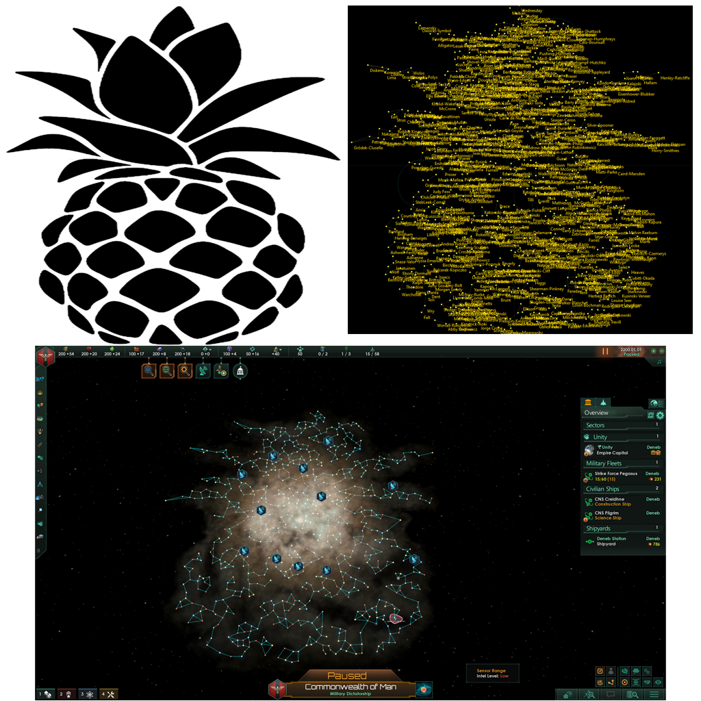

  <b>Custom Galaxy Creation & Editing Toolkit for Stellaris</b> 
  Design, generate, edit, and export fully customized Stellaris galaxy maps with complete visual control.

  
  
  

---

# Download

## Latest Release (v1.0.4)

[Download Stellaris Map Editor v1.0.4](https://github.com/non-npc/Stellaris-Map-Editor/releases/download/v1.0.4/Stellaris_map_editor_v104.zip)

---

# Features

- Interactive real-time galaxy editor
- Procedural galaxy generation
- Custom PNG galaxy shape masks
- Hyperlane editing
- Wormhole editing
- Gateway editing
- Nebula editing
- Star system editing
- Advanced galaxy generation settings
- Real-time visual galaxy preview
- Export directly into Stellaris-compatible mod format
- Supports symbolic and geometric galaxy layouts
- Automatic galaxy scaling based on star count and galaxy size

---

# Table of Contents

- [Quick Start](#quick-start)
- [Custom Galaxy Shapes](#custom-galaxy-shapes)
- [Screenshots](#screenshots)
- [Editing Features](#editing-features)
- [Tips](#tips)
- [Known Limitations](#known-limitations)
- [Version History](#version-history)

---

# Works On

- Windows 10
- Windows 11

---

# Stellaris Version

- Stellaris 4.3.7

---

# Quick Start

## 1. Create a New Project

Launch the editor and create a new galaxy project.

## 2. Generate or Import a Galaxy Shape

You can either:
- Generate a procedural galaxy
- Import a custom PNG mask shape

## 3. Edit the Galaxy

Modify:
- Stars
- Hyperlanes
- Nebulas
- Wormholes
- Gateways
- Clusters

## 4. Export the Galaxy

Export directly into a playable Stellaris mod format.

---

# Custom Galaxy Shapes

Stellaris Map Editor supports fully custom galaxy layouts using black-and-white PNG mask images.

You can create:
- Symbols
- Logos
- Geometric patterns
- Chokepoint maps
- Artistic galaxy designs
- Hand-drawn galaxy layouts

---

# Creating a Custom Shape Mask

Creating a custom galaxy shape is simple:

1. Create a `1024x1024` PNG image
2. Use a transparent or white background
3. Paint the desired galaxy area in black
4. Save the PNG image
5. Import it into the editor

### Mask Rules

| Color | Result |
|---|---|
| Black | Valid galaxy generation area |
| White / Transparent | Empty space |

---

# Custom Shape Galaxy Tutorial

## Step 1 — Import a Shape

1. Open **Stellaris Map Editor**
2. Open the **Custom Shapes** menu
3. Click **Add Custom Galaxy Shape**
4. Select your PNG mask image

The shape will appear in the custom shape list.

---

## Step 2 — Generate the Galaxy

1. Open the **Generate** menu
2. Click **Generate Custom Galaxy**
3. Select your imported shape
4. Choose:
   - Galaxy size
   - Star count
   - Hyperlane density
   - Additional settings
5. Click **Generate Galaxy**

The editor will automatically scale the shape based on the selected galaxy size and star count.

---

## Step 3 — Export the Galaxy

1. Review the generated galaxy
2. Open the **Export** menu
3. Click **Export Mod**

Your custom galaxy is now ready for Stellaris.

---

# Screenshots

## Create a New Project

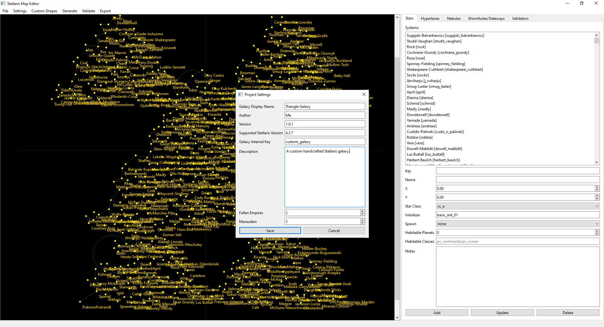

---

## Import a Custom Shape

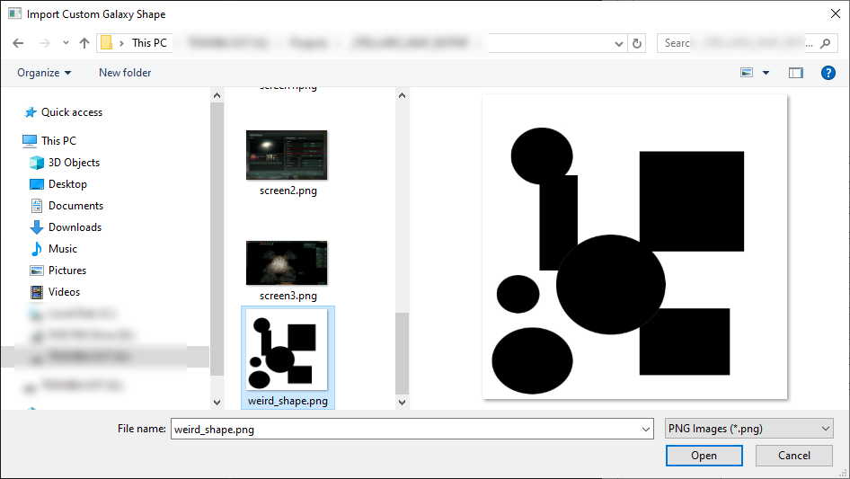

---

## Generate a Galaxy from a Shape

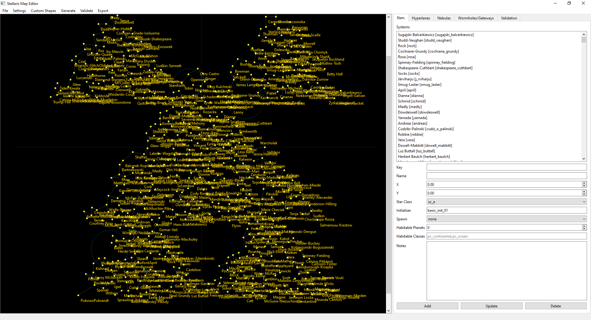

---

## Load the Galaxy In-Game

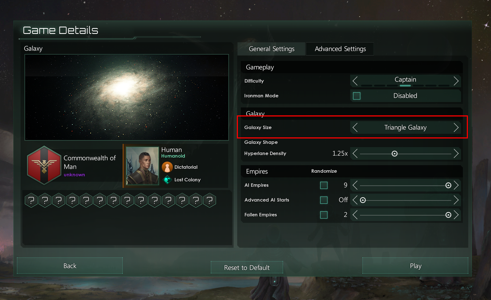

---

## Example Custom Galaxy

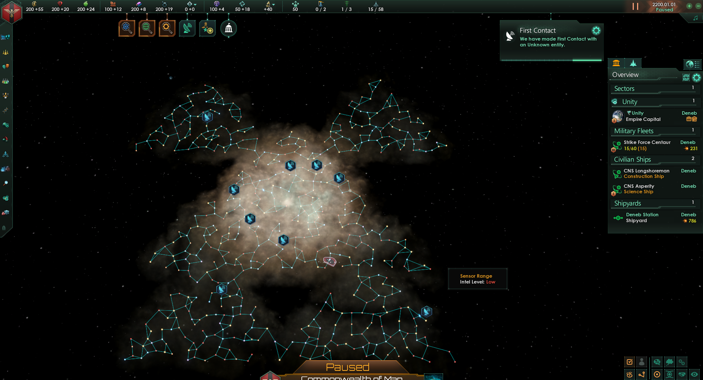

---

## Example Custom Mask Images

### Triangle Shape

### Abstract Shape

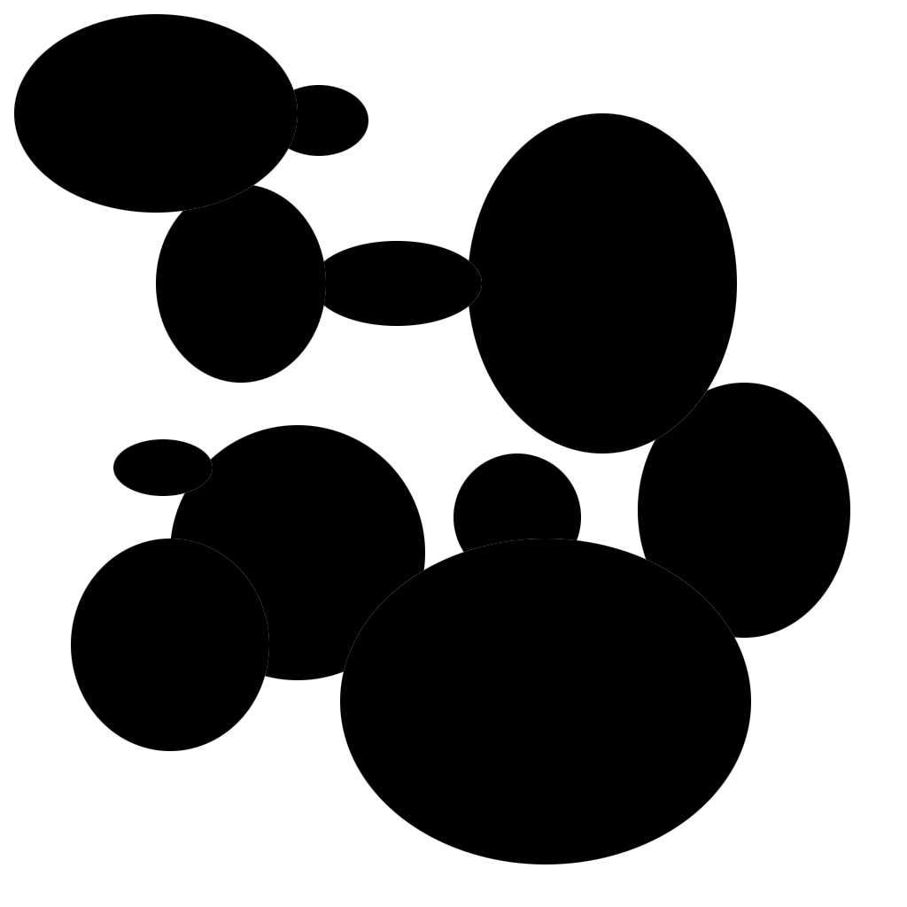

### Liquid Shape

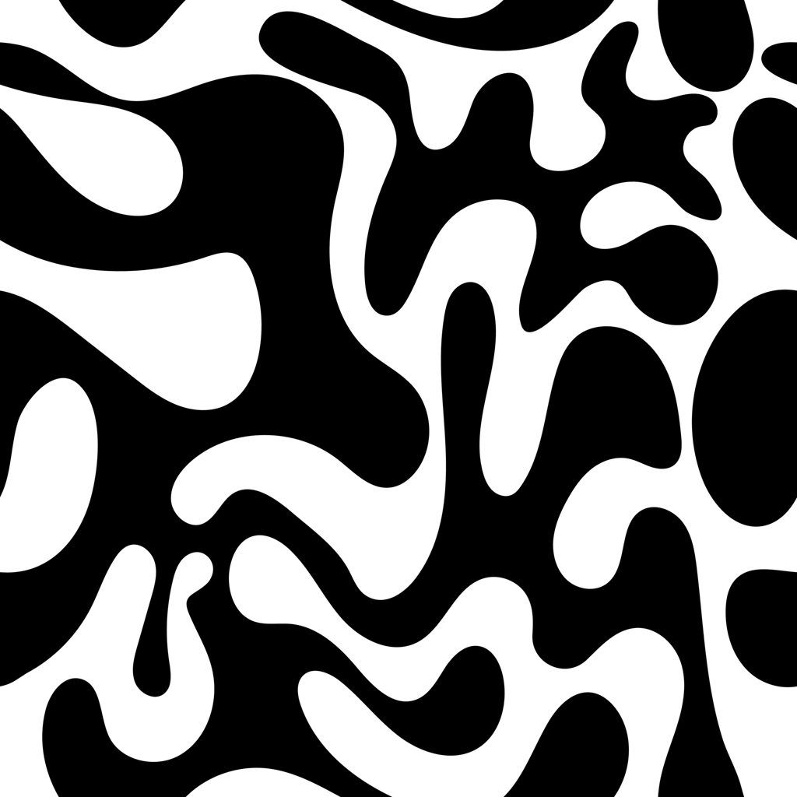

---

## Editing a Star System

---

## Advanced Galaxy Generation Settings

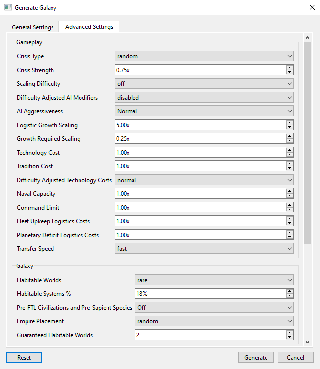

---

## Hyperlane Editing

To create a hyperlane:
1. Select the first star
2. Select the second star
3. Click **Add Hyperlane**

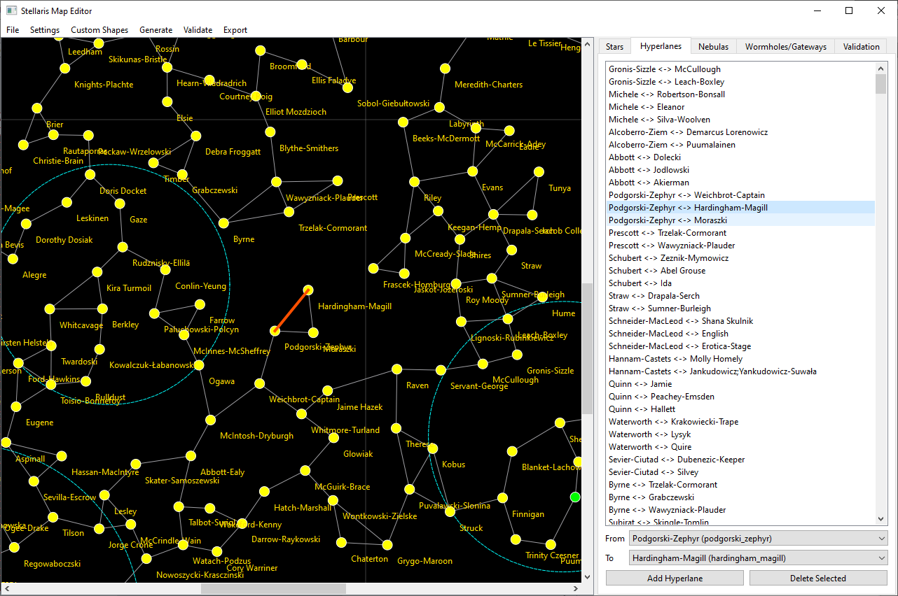

---

## Nebula Editing

Nebulas can be added and resized from the Nebula tab.

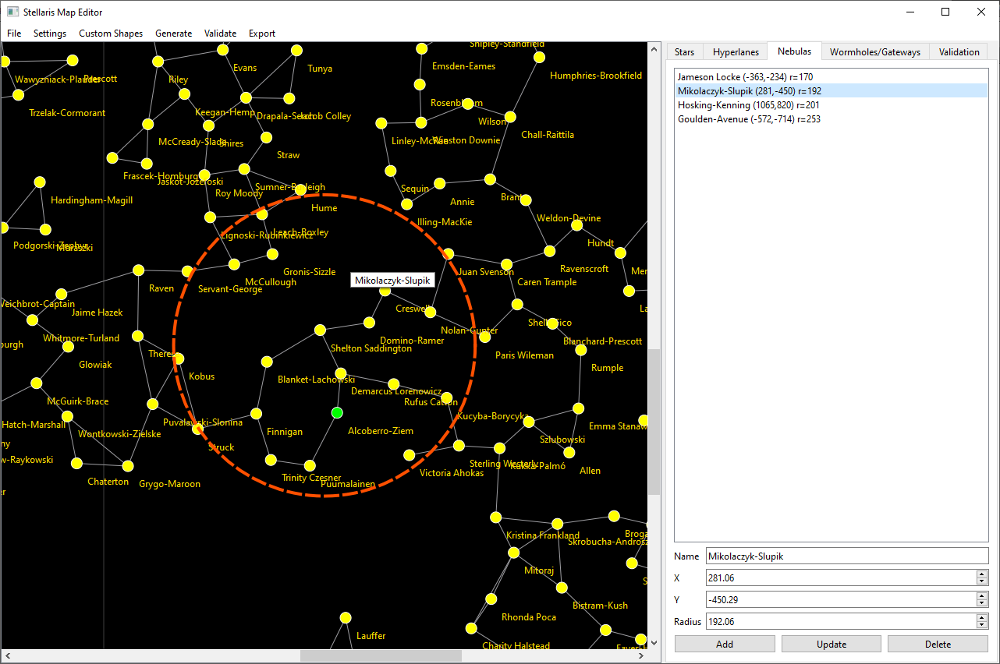

---

## Wormhole Editing

Select two stars (from drop downs) and create a wormhole pair.

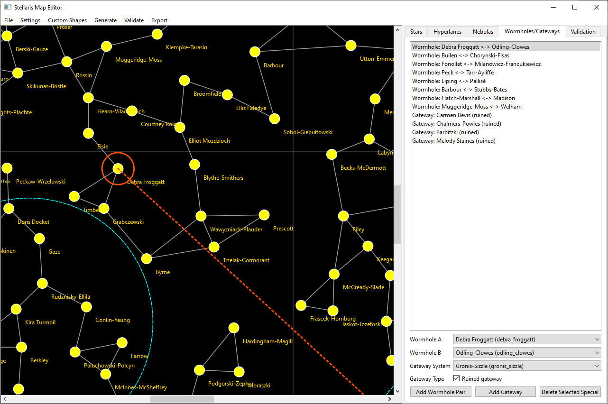

---

## Gateway Editing

Select a star (from drop down) and add a gateway.

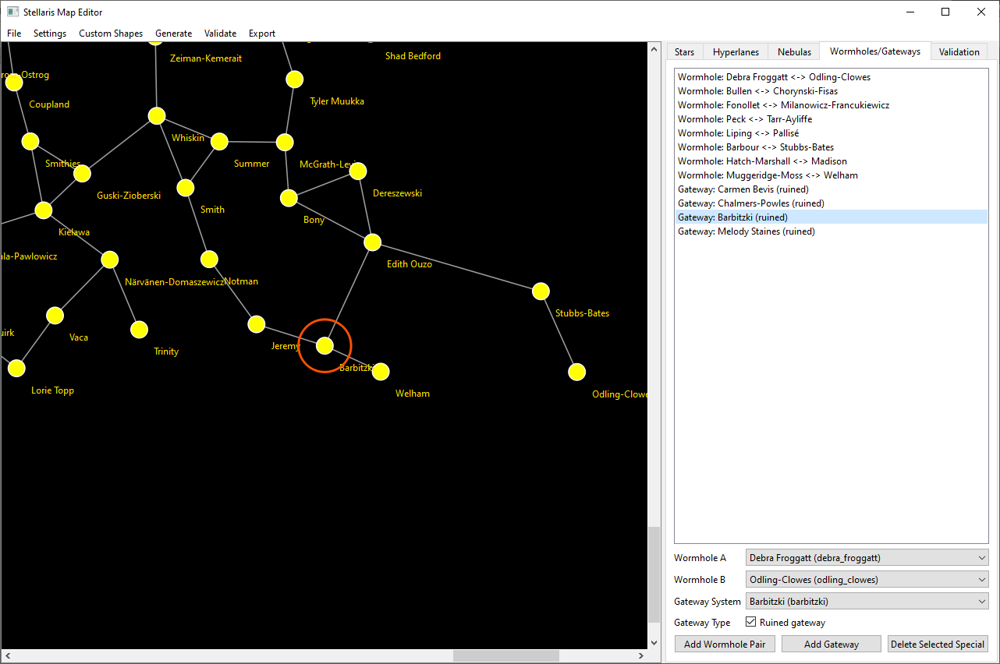

---

## Large Galaxy Examples

### 2000 Star Galaxy

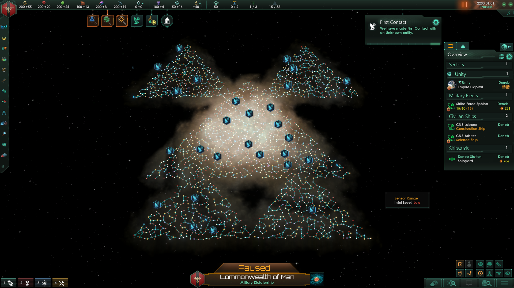

### 1000 Star Chokepoint Galaxy

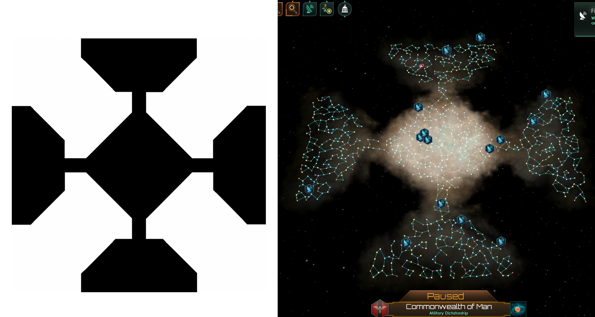

---

# Editing Features

## Star Editing

- Create stars
- Move stars
- Rename stars
- Modify system data
- Configure planets and moons

## Hyperlane Editing

- Create hyperlanes
- Remove hyperlanes
- Quickly search systems using keyboard shortcuts

## Nebula Editing

- Create nebulas
- Resize nebulas
- Reposition nebulas

## Wormhole Editing

- Create paired wormholes
- Configure wormhole endpoints

## Gateway Editing

- Add gateways to systems
- Configure gateway placement

---

# Tips

## Moving Objects

If objects are difficult to drag:
- Zoom in using the mouse wheel
- Fine placement becomes much easier when zoomed closer

---

## Panning the Map (in star tab only)

Click and drag empty space to pan around the galaxy.

---

## Searching for Systems

In dropdown fields you can repeatedly press a letter to quickly cycle through matching system names.

Example:
- Press `S` repeatedly to quickly locate systems beginning with `S`

---

# Known Limitations

- Only stars can currently be moved directly on the canvas
- Nebulas, wormholes, gateways, and hyperlanes are edited from their respective tabs
- Very large galaxies may take longer to generate (2000 stars take about 45s-60s)

---

# Version History

## v1.0.4

- Hyperlanes tab improvements
- Selecting a second star now automatically fills the **To** field
- Existing hyperlanes auto-select in the list
- Delete Selected now removes the lane between From and To

## v1.0.3

- Fixed a y-axis bug when moving stars

## v1.0.2

- Added **Move Selected Star** button

## v1.0.1

- Selected objects now auto-center on the canvas
- Improved visual highlights for selected objects

---

# Credits

Created for the Stellaris modding community.

---

# License

This project is provided as-is for personal and community use.
